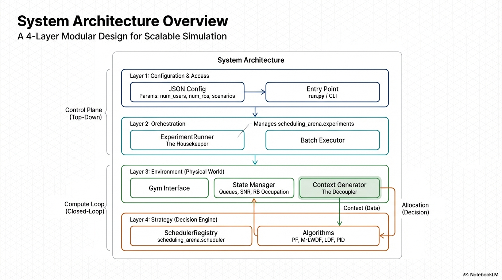

# SchedulingArena


### Architecture
<!-- 插入架构图 -->


The platform adopts a layered architecture designed for **Separation of Concerns**, ensuring that algorithm design is decoupled from physical environment simulation while maintaining a high-fidelity closed-loop interaction.

The system is organized into four logical layers:

#### 1. Configuration Layer (Inputs)
*   **Definition**: The entry point for defining "what to run."
*   **Components**: JSON configuration files and the CLI entry point (`run.py`).
*   **Function**: Users define global environment parameters (e.g., `num_users`, `num_rbs`) and experiment scenarios (e.g., comparing "Baseline-PF" vs. "Adaptive-MLWDF") without modifying code.

#### 2. Orchestration Layer (Control)
*   **Definition**: The "Experiment Runner" (`scheduling_arena.experiments`).
*   **Function**: Manages the lifecycle of experiments. It parses configurations, instantiates environments, and executes batch experiments automatically.

#### 3. Intrusive Simulation Link (Core Engine)
*   **Definition**: The high-fidelity, closed-loop simulation core (`scheduling_arena.env`).
*   **Mechanism**:
    *   **Intrusive Design**: The scheduler is embedded directly into the simulation's critical path.
    *   **The Loop**: In every Transmission Time Interval (TTI), the environment generates a state `Context`. The simulation **blocks** until the scheduler returns an `Allocation`.
    *   **Update**: The environment applies the allocation, updates queues and channel states, and proceeds to the next TTI.

#### 4. Strategy & Meta-Scheduling Layer (Algorithms)
*   **Definition**: The decision-making logic (`scheduling_arena.scheduler`).
*   **Core Schedulers**: Algorithms like **PF**, **M-LWDF**, and **LDF** that handle Resource Block (RB) allocation based on the provided context.
*   **Meta-Schedulers (PID Agents)**: A higher-level adaptive layer. Instead of allocating RBs directly, **PID Agents** monitor performance error (e.g., delay violation) and dynamically tune the hyperparameters (e.g., the $\beta$ weight in M-LWDF) of the Core Scheduler in real-time.

---

### Key Features

*   **Decoupled Architecture**: Algorithms interact with the environment solely through a standardized data `Context`, meaning researchers do not need to manage complex physical layer details.
*   **Adaptive Meta-Scheduling**: Supports "Self-Driving" scheduling where PID agents automatically tune algorithm parameters during the simulation to adapt to traffic fluctuations.
*   **Zero-Code Orchestration**: Complete experiment workflows—from scenario definition to execution—are driven entirely by declarative JSON configuration files.
*   **Extensible Registry**: New algorithms can be added simply by inheriting from `BaseScheduler` and using the `@SchedulerRegistry` decorator.


## Installation

```bash
# Install in development mode
pip install -e .

# Or install normally
pip install .
```

## Quick Start

### 1. Using Python Script (Simplest - Recommended)

```bash
# Just run with a JSON config file
python run.py examples/quick_test.json
python run.py examples/config_example.json
```

### 2. Using Command Line Tool

```bash
# Run experiments from a config file (positional argument)
scheduling-arena examples/config_example.json

# Or use --config flag (legacy)
scheduling-arena --config examples/config_example.json

# Run default baseline experiments
scheduling-arena
```

### 3. Configuration File Format

Create a JSON config file to define your experiments:

```json
{
  "tti_steps": 1000,
  "env": {
    "num_users": 60,
    "num_rbs": 100,
    "tti_duration": 0.001,
    "scbr_bytes": 850,
    "tcbr_ms": 60,
    "pf_window_size": 100,
    "channel_mean_low_db": 10,
    "channel_mean_high_db": 20
  },
  "scenarios": [
    {
      "name": "Baseline-PF",
      "scheduler": {
        "type": "PF"
      }
    },
    {
      "name": "Baseline-MLWDF",
      "scheduler": {
        "type": "M-LWDF",
        "params": {
          "delta_u": 0.05,
          "tau_u": 0.1
        }
      }
    },
    {
      "name": "Heavy-Load-PF",
      "scheduler": {
        "type": "PF"
      },
      "env": {
        "num_users": 120,
        "tcbr_ms": 30
      }
    }
  ]
}
```

### 4. Environment Parameters

Global environment parameters (in `"env"` at top level) apply to all scenarios. Each scenario can override specific parameters in its own `"env"` section.

Available parameters:
- `num_users`: Number of users (default: 60)
- `num_rbs`: Number of resource blocks (default: 100)
- `tti_duration`: TTI duration in seconds (default: 0.001)
- `scbr_bytes`: SCBR packet size in bytes (default: 850)
- `tcbr_ms`: TCBR period in milliseconds (default: 60)
- `pf_window_size`: Proportional fair window size (default: 100)
- `channel_mean_low_db`: Lower bound of channel mean SNR in dB (default: 10)
- `channel_mean_high_db`: Upper bound of channel mean SNR in dB (default: 20)

### 5. Available Schedulers

- `"PF"`: Proportional Fair
- `"Ehanced-PF"`: Enhanced Proportional Fair (requires `tau_u` param)
- `"M-LWDF"`: Modified Largest Weighted Delay First (requires `delta_u`, `tau_u` params)
- `"B-M-LWDF"`: Beta-controlled M-LWDF (requires `delta_u`, `tau_u` params)
- `"LDF"`: Largest Delay First
- `"PDU set scheduling"`: ensure IP block transmission
### 6. Available Agents

- `"PID-constant"`: PID controller with constant gains
- `"PID-scheduled"`: PID controller with gain scheduling

## Architecture

The package is designed with clear separation of concerns:

- **Schedulers** (`scheduling_arena.scheduler`): Implement scheduling algorithms by inheriting from `BaseScheduler` and registering with `SchedulerRegistry`. Schedulers only depend on the `context` dictionary provided by the environment.

- **Environment** (`scheduling_arena.env`): Provides a Gym-compatible environment that simulates wireless scheduling scenarios. It accepts scheduler configuration and environment parameters.

- **Experiments** (`scheduling_arena.experiments`): Provides `ExperimentRunner` and `run_from_config()` to execute batch experiments from JSON configurations.

## Adding New Schedulers

To add a new scheduler:

1. Create a class inheriting from `BaseScheduler`
2. Implement the `schedule(context)` method
3. Register it with `@SchedulerRegistry.register("YourSchedulerName")`

Example:

```python
from schedulingArena.scheduler import BaseScheduler, SchedulerRegistry

@SchedulerRegistry.register("MyScheduler")
class MyScheduler(BaseScheduler):
    def schedule(self, context):
        potential_rates = context['potential_rates']
        # ... your scheduling logic ...
        return allocation  # numpy array of user indices per RB
```

## License

[Your License Here]

